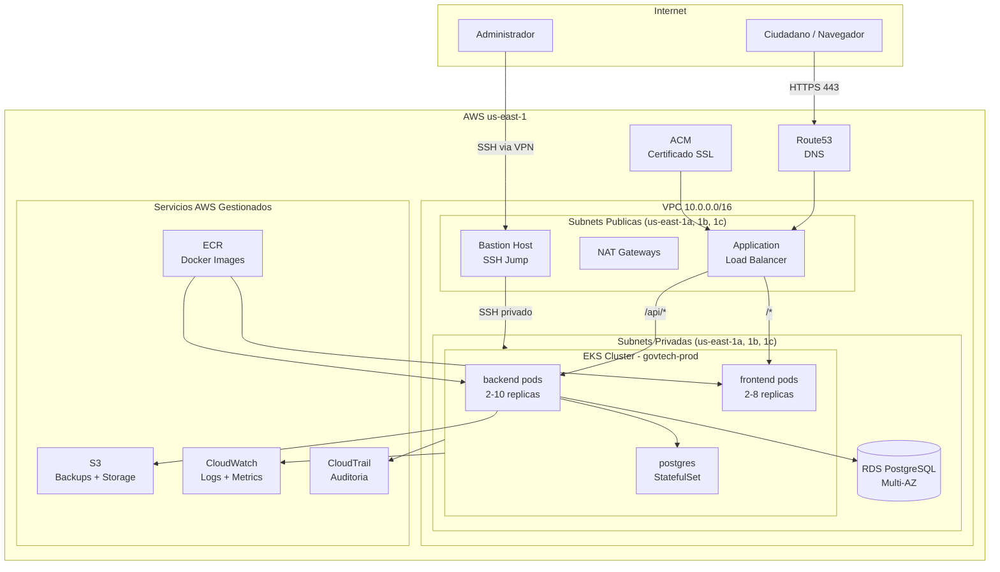
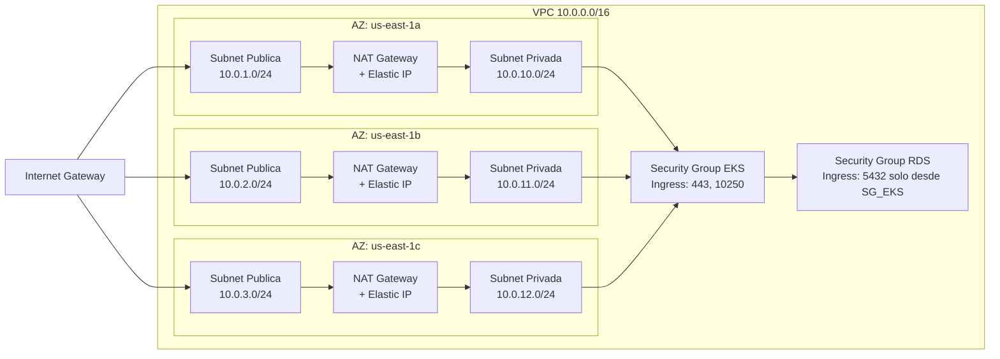
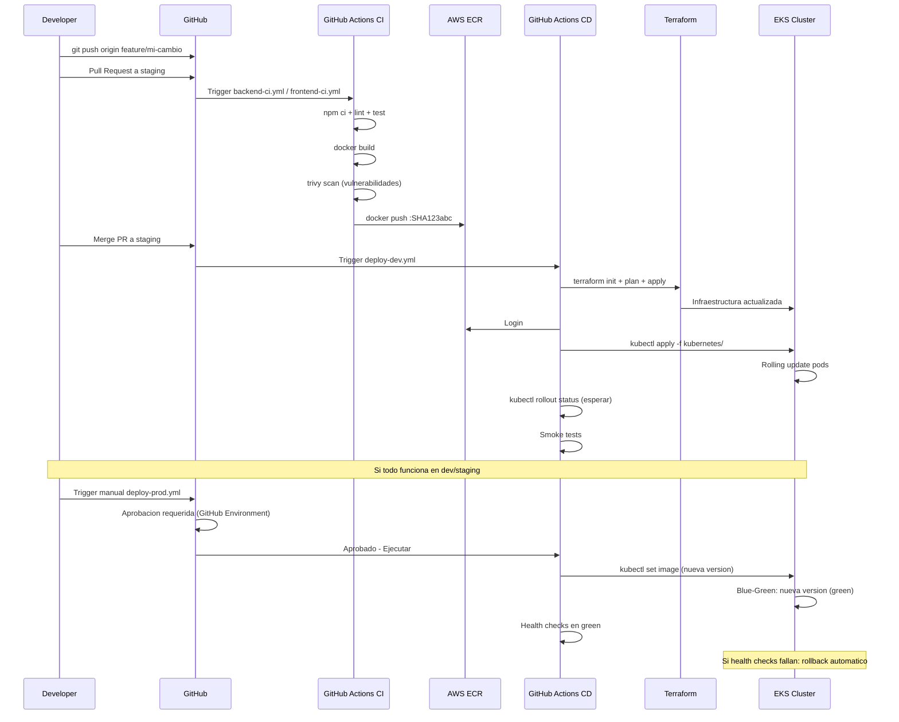
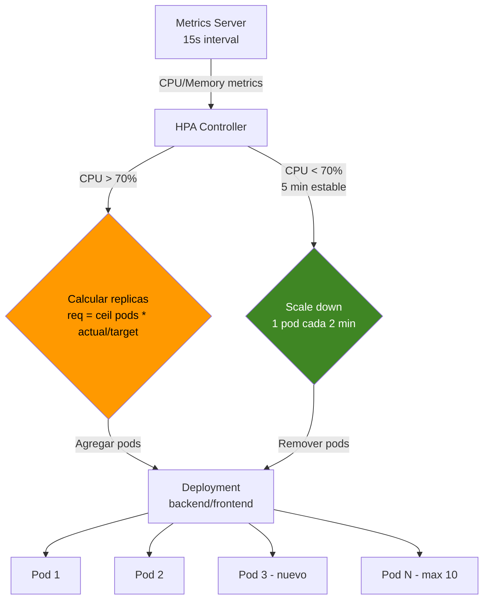
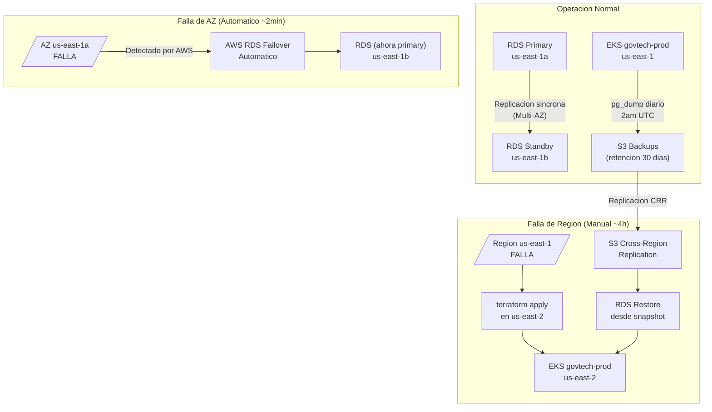
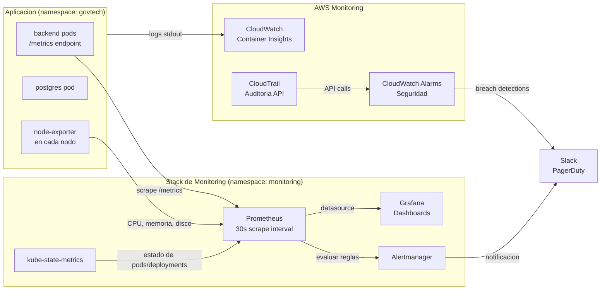

# Diagramas de Arquitectura - GovTech Cloud Migration Platform

---

## 1. Arquitectura General (Vista de Alto Nivel)

---

## 2. Arquitectura de Red (VPC)

---

## 3. Pipeline CI/CD

---

## 4. Flujo de Autoscaling (HPA)

---

## 5. Arquitectura de Recuperacion ante Desastres

---

## 6. Stack de Monitoring

