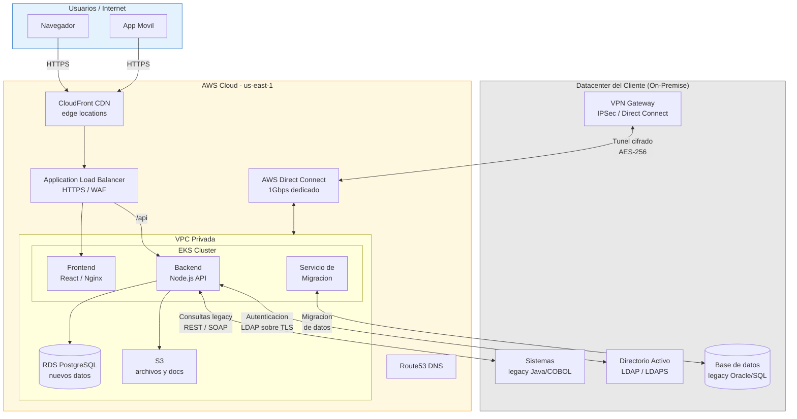
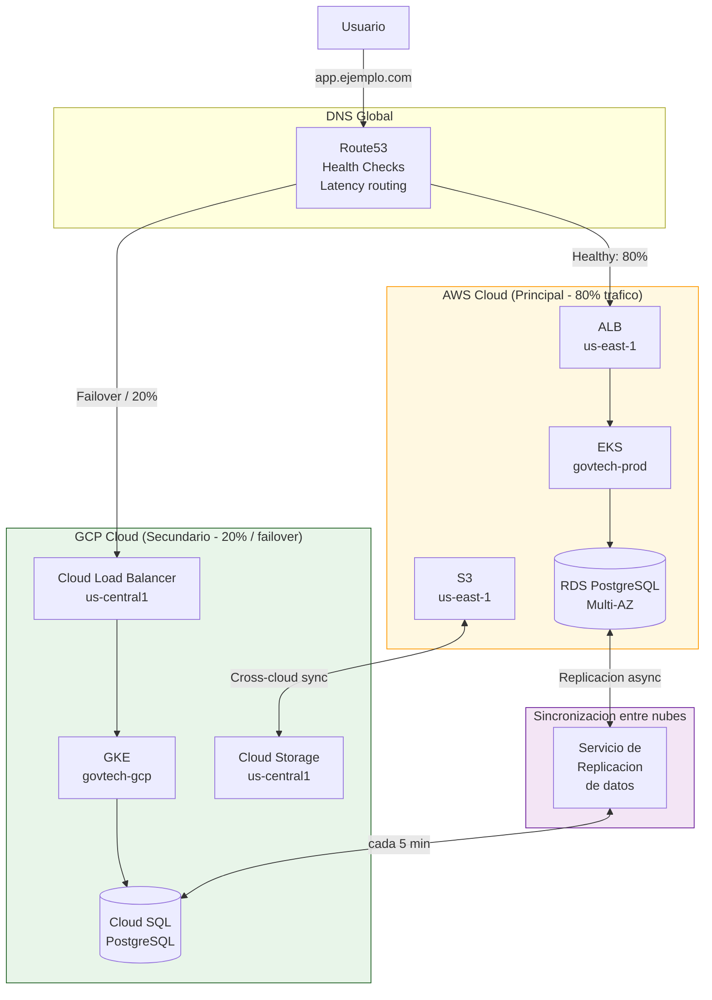
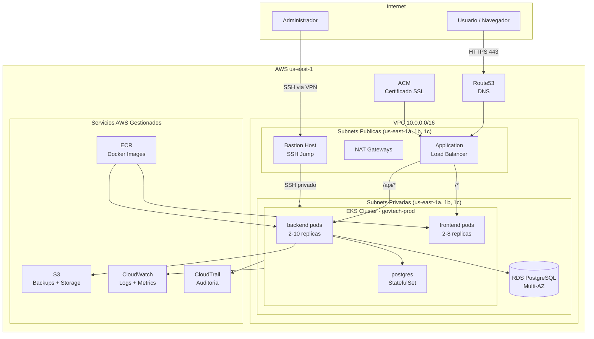
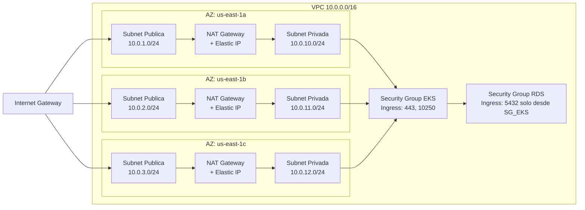
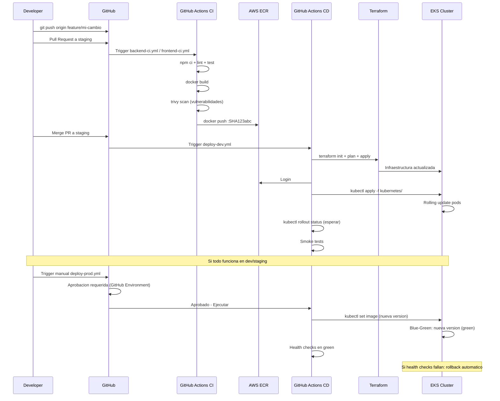
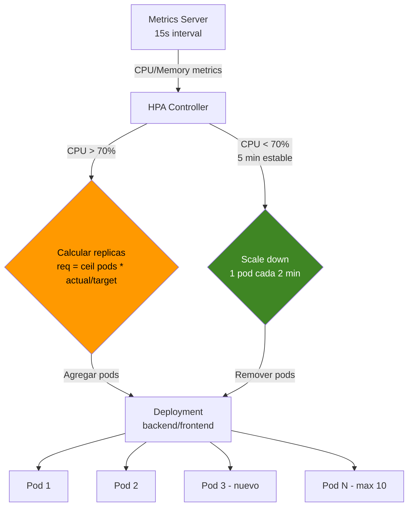
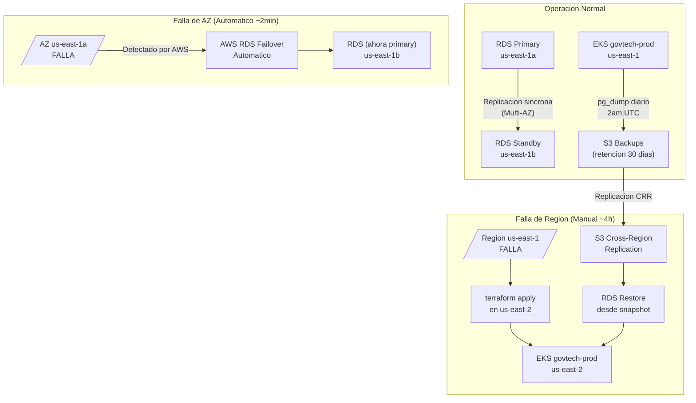
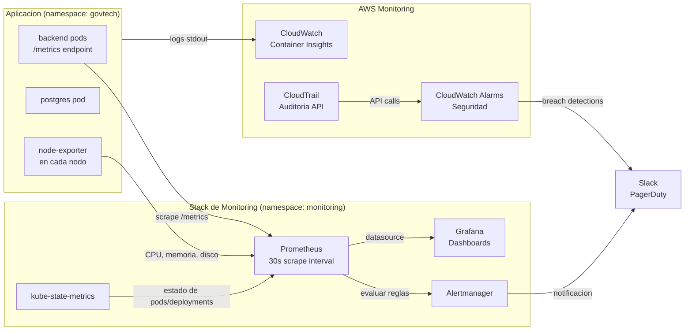

# Diagramas de Arquitectura - GovTech Cloud Migration Platform

> **Enfoque:** Arquitectura hibrida con AWS como nube principal e integracion con
> infraestructura on-premise del cliente. El diseno es cloud-agnostic en la capa
> de aplicacion (Kubernetes) para permitir portabilidad futura a otros proveedores.

---

## 1. Arquitectura Hibrida (On-Premise + AWS Cloud)

Este diagrama muestra el escenario de una organizacion: sistemas legacy en datacenter
propio que se integran con nuevos servicios en AWS. La migracion es gradual, no total.

**Por que hibrido y no 100% cloud:**
- Las organizaciones tienen sistemas legacy de decadas que no pueden migrarse de golpe
- Algunas regulaciones exigen que ciertos datos permanezcan en la infraestructura propia
- La migracion gradual reduce el riesgo operativo
- Direct Connect da conectividad privada (no pasa por internet publico)

---

## 2. Arquitectura Multicloud (AWS + GCP como nube secundaria)

Escenario de alta disponibilidad maxima: si AWS us-east-1 falla completamente,
el trafico se redirige a GCP automaticamente via Route53 health checks.

**Cuando aplica este modelo:**
- Requisito de disponibilidad 99.99% (menos de 52 min de downtime al año)
- Regulaciones que exigen no depender de un solo proveedor
- Reduccion de riesgo ante fallas de region completa

**Estado de implementacion:**
- AWS: **implementado** (Terraform + Kubernetes manifests en este repositorio)
- GCP: **disenado** (pendiente de implementacion si el cliente lo requiere)

---

## 3. Arquitectura General AWS (Vista de Alto Nivel)

---

## 4. Arquitectura de Red (VPC)

---

## 5. Pipeline CI/CD

---

## 6. Flujo de Autoscaling (HPA)

---

## 7. Arquitectura de Recuperacion ante Desastres

---

## 8. Stack de Monitoring

